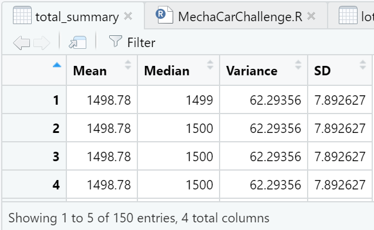
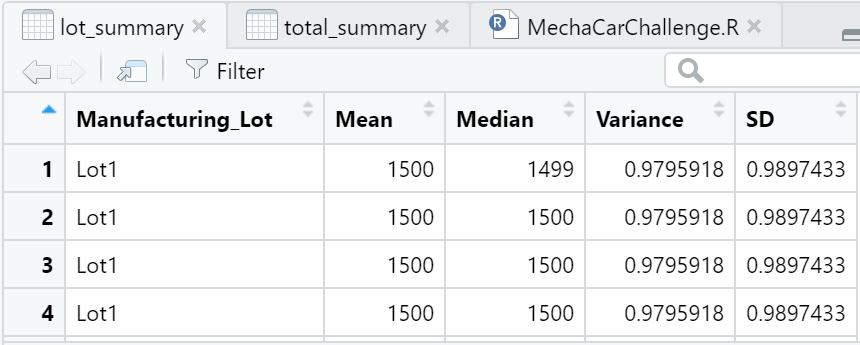

# MechaCar_Statistical_Analysis

## Project Overview
This project involves the use of R and R Studio to perform statistical analysis - summary statistics, linear regression, T test - to assess vehicle performance based on multiple criteria.

## Resources
- Data Source: 
- Software: R, R Studio

## Linear Regression to Predict MPG

formula = mpg ~ vehicle_length + vehicle_weight + spoiler_angle + ground_clearance + AWD

Coefficients:
     (Intercept)    vehicle_length  
      -1.040e+02         6.267e+00  
  vehicle_weight     spoiler_angle  
       1.245e-03         6.877e-02  
ground_clearance               AWD  
       3.546e+00        -3.411e+00  

# Summary Statistics
formula = mpg ~ vehicle_length + vehicle_weight + spoiler_angle + 
    ground_clearance + AWD

Residuals:
     Min       1Q   Median       3Q      Max 
-19.4701  -4.4994  -0.0692   5.4433  18.5849 

Coefficients:
                   Estimate Std. Error t value
(Intercept)      -1.040e+02  1.585e+01  -6.559
vehicle_length    6.267e+00  6.553e-01   9.563
vehicle_weight    1.245e-03  6.890e-04   1.807
spoiler_angle     6.877e-02  6.653e-02   1.034
ground_clearance  3.546e+00  5.412e-01   6.551
AWD              -3.411e+00  2.535e+00  -1.346
                 Pr(>|t|)    
(Intercept)      5.08e-08 ***
vehicle_length   2.60e-12 ***
vehicle_weight     0.0776 .  
spoiler_angle      0.3069    
ground_clearance 5.21e-08 ***
AWD                0.1852    
---
Signif. codes:  
0 ‘*’ 0.001 ‘*’ 0.01 ‘*’ 0.05 ‘.’ 0.1 ‘ ’ 1

Residual standard error: 8.774 on 44 degrees of freedom
Multiple R-squared:  0.7149,	Adjusted R-squared:  0.6825 
F-statistic: 22.07 on 5 and 44 DF,  p-value: 5.35e-11

Pr(>|t|) values represent the probability that each coefficient contributes a random amount of variance to the linear model. Based on the data, vehicle length and ground clearance (and Intercept) provide a non-random amount of variance to the linear model of mpg.

Based on the results, slope of the linear model is not zero.

The multi-linear model is as follows:
mpg = 6.27 * vehicle_length + 1.25e-3 * vehicle_weigth + 6.88e-2 * spoiler_angle -3.41 * AWD + 3.55 * ground_clearance - 1.04e+2

This can be approximated to: mpg = 6.27 * vehicle_length - 3.41 * AWD + 3.55 * ground_clearance - 104

R-square is 0.7140. Based on this data, approxmiately 71% of the variations in mpg are explained by changes in the vehicle length, the vehicle weight, the spoiler angle, the drivetrain and the ground clearance. This linear model as fairly efficient in predicting mpg of MechaCar prototypes.

## Summary Statistics on Suspension Coils

The current manufacturing data must meet the design specification (not to exceed 100 lbs per square inch) for all manufacturing lots in total and each lot individually. Based on the data/charts below, ehe design specs are true for all manufacturing lots in total. The global variance of 62.3 psi.
On the lot level, Lot 1 and Lot 2 are within specification range. However, Lot 3 specifically, is out of specification range. PSI exceeds limitation.

### total_summary Mean=mean(PSI),Median=(PSI),Variance=var(PSI),SD=sd(PSI)

### lot_summary

## T-Test on Suspension Coils

	One Sample t-test

data:  Suspension$PSI
t = -1.8931, df = 149, p-value = 0.06028
alternative hypothesis: true mean is not equal to 1500
95 percent confidence interval:
 1497.507 1500.053
sample estimates:
mean of x 
  1498.78 

Significance level is 0.05. This studies p-value 0.06028 which is above the significance level. Therefore, we do not reject the null hypothesis. The PSI across all manufacturing lots is statiscally similar to the population mean of 1498.78 psi.

For the data below, do not reject the null on lots 1 and 2. Reject the null hypothesis on lot 3 (p-value 0.04168)

### T-test on Lot 1
t = 0, df = 49, p-value = 1
alternative hypothesis: true mean is not equal to 1500
95 percent confidence interval:
 1499.719 1500.281
sample estimates:
mean of x 
     1500 

### T-test on Lot 2
t = 0.51745, df = 49, p-value = 0.6072
alternative hypothesis: true mean is not equal to 1500
95 percent confidence interval:
 1499.423 1500.977
sample estimates:
mean of x 
   1500.2 

### T-test on Lot 3
t = -2.0916, df = 49, p-value = 0.04168
alternative hypothesis: true mean is not equal to 1500
95 percent confidence interval:
 1492.431 1499.849
sample estimates:
mean of x 
  1496.14 

## Deliverable 4: Design a Study Comparing the MechaCar to the Competition

### MechaCar Design Study
The average car buyer will look not only at design/appearance, but will look at closely at cost and fuel efficiency. By assessing these metrics, MechaCar can succeed against the competition. To perform these tests, the data for MechaCars and it's competitors is needed.

For fuel efficiency, an ANOVA tests could be used to compare the means of a continuous numerical variable across a number of groups. A one-way ANOVA could be used to test against multiple groups - such as fuel efficiency of different cars based on vehicle type. In this test, the null hypotheses is that there is no difference among the means of mpg of all groups. The alternate hypotheses is that at least one of the means is different from all other groups.

To compare the cost of among competitors we could perform ANOVA test. For this test, the null hypotheses is that there is no difference among means of costs of all groups. The alternate hypotheses is that at least one of the means is different from all other groups.
